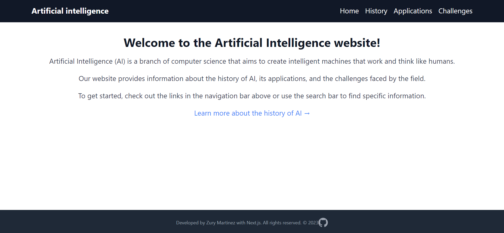
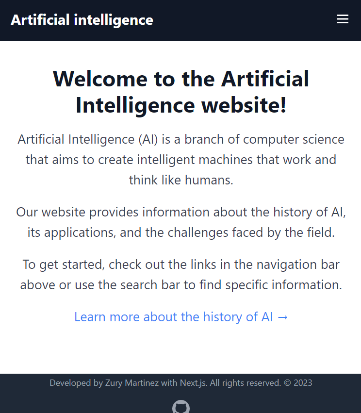

This project involves creating a website about Artificial Intelligence (AI) using the JavaScript framework, React, and styling it with the Tailwind CSS framework. The website includes several pages, including a home page, a history of AI page, an AI applications page, and an AI challenges page. Reusable components such as a header and footer are also included. The website provides information about the history of AI, current and future applications of AI, and the challenges faced by the field. Links and a search bar are also included for easy user navigation.

